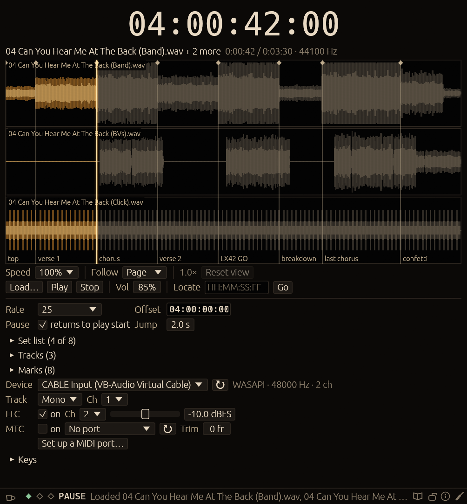
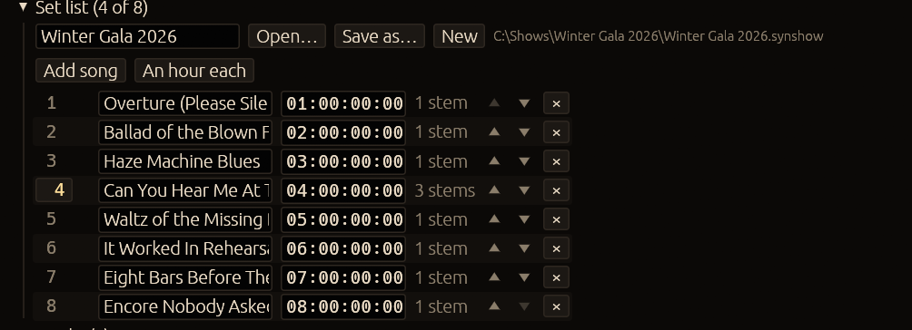

<div align="center">


# Synphonos

**A timecode generator that plays the show.**

Synphonos plays your audio and sends SMPTE timecode locked to where that audio has
got to. Press Play, and the console follows.

[**Download for Windows**](../../releases/latest) · [What it does](#what-it-does) · [Quick start](#quick-start) · [If something goes wrong](#if-something-goes-wrong)

Windows 10/11 · 64-bit · one file · free

</div>

---

## Download

**[Get the latest release](../../releases/latest)** — one zip, about 28 MB, holding three files:

| File | What it is |
|---|---|
| `synphonos.exe` | The program. One self-contained file, about 18 MB. |
| `LICENCE.txt` | The licence, terms and privacy notice. Keep it with the exe — its own section 2 asks anyone passing the program on to include it. |
| `Synphonos - How to use.pdf` | The manual: 33 pages, every control, with a screenshot of each. |

There is no installer. Unzip it somewhere sensible — a folder on the show machine's
desktop is fine — and double-click the program. Nothing is installed, no runtime is
needed, no registry keys are written, and deleting the folder removes it.

> **SmartScreen.** Windows has not seen this program before, so it may warn you the
> first time you run it. *More info* → *Run anyway*.

On the first run the licence appears as a gate that has to be accepted before the
program can be used. You are only asked once.

## What it does

A lighting or video desk that runs from timecode needs something to tell it what time
it is. Synphonos is that something, and it is also the thing playing the music — which
is the point. The timecode is not synchronised to the audio; it is **counted from it**,
one sample at a time, in the same audio callback that fills the output buffer. There is
nothing to line up and nothing that can drift.

It sends timecode two ways, and you can use either or both at once:

- **LTC** — longitudinal timecode, as audio, on a channel of the same output device.
  Plug that channel into the desk's timecode input.
- **MTC** — MIDI timecode, as quarter-frame messages, out of a MIDI port. On Windows
  that usually means a virtual port such as loopMIDI, to another program on the same
  machine.

<div align="center"></div>

### What it is not

Synphonos is a **generator only**. It will not chase timecode coming in from somewhere
else, it will not free-run without a file, and it will not loop. If you need a machine
that follows another machine, this is the wrong tool — and [what it won't do](#what-it-wont-do)
is an honest list of the rest.

### What you need

- A Windows 10 or 11 machine, 64-bit.
- An audio output with a spare channel for LTC — or a MIDI port, for MTC.
- A desk that reads timecode, set to the same frame rate.
- Your show's audio, in any ordinary format.

No installer, no runtime, no licence key, no internet connection.

## Quick start

1. **Run it.** Click through the start-up animation, accept the licence.
2. **Load a song** with *Load…*, or drop files on the window.
3. **Outputs** — pick your device, then send *Track* to a stereo pair and *LTC* to a
   channel of its own. Patch that channel into the desk's timecode input.
4. **Rate & offset** — set the frame rate to match the desk (24, 25, 29.97 NDF,
   29.97 DF or 30), and the offset to the timecode the song starts at.
5. **Press Play.** The desk should lock.

For MTC instead of LTC, see [MTC on Windows](#mtc-on-windows-loopmidi).

> **Before the doors open:** play a song, watch the desk take the timecode, lock the
> show. That three-step check catches the rate, the routing and the port, which between
> them are almost every problem anyone has.

## What is in it

**The set list.** A *show* is the whole evening: an ordered list of songs, each with its
own stems, its own start offset and its own marks. Click a song's number to load it, or
give *Previous song* and *Next song* keys and run the set from the lighting console.
*An hour each* puts song 1 at `01:00:00:00`, song 2 at `02:00:00:00` and so on, so one
song's cues can never match another's.

<div align="center"></div>

**Show files.** *Save as…* writes a `.synshow`: the set list, the stems, the offsets and
the marks. The device, the port, the keys and the look stay in the machine's own
settings — so a show copies to a **backup rig** without dragging the first machine's
device names with it. Each track is stored as an absolute path *and* relative to the
show file, so a show folder copied to another drive finds its own audio.

**Stems.** Up to 8 files play together as one song — the instrumental, the BVs, the MD
track. They share a transport, a position and one set of timecode, so there is nothing
to line up. Each gets a mute, a level and its own channels, so a stem can go to the desk
separately. Different lengths are fine.

**Marks.** Named points in the song — *verse1*, *chorus* — saved with it and back when it
loads. Page Up and Page Down step between them, and any mark can be given a key that
goes straight to it.

**The waveform.** The whole track, filling in as it scans. Click to move the playhead;
Ctrl+scroll zooms in to 24 points per frame, with ticks on every frame boundary;
Shift+scroll moves along; Alt+scroll changes its height. *Follow* decides what a
zoomed-in view does while playing: page ahead, keep the playhead centred, or stay put.

**Speed.** 10% to 200%, like a tape — the pitch moves with it. Timecode keeps to the
track: at 50%, one second of timecode takes two seconds, LTC comes out at half speed and
MTC quarter-frames half as often. Changeable while playing.

**Keys, including from other apps.** Every action can be given two keys. Tick a key and
it works while **another program has focus** — so the set runs from grandMA2 without
touching the timecode machine. Ticked keys show in gold, and Synphonos hands them back
whenever its own window has focus. Windows only.

**The lock.** The padlock at the end of the status bar runs the show without letting
anything change it. Play, pause, jumps, marks, *Next song* and the levels keep working;
stems, marks, offsets, the frame rate, the channels and the running order are frozen.
**Stop asks twice** — Escape is the key a hand reaches for by reflex. It survives a
restart: a show machine left locked comes back locked.

**The look.** Six presets — Gold, Ember, Rose, Verdant, Moonlight, Mono — or set the
accent, ground and text yourself and everything else follows. Glow, scale, density and
waveform height are all adjustable, as is how much of the start-up animation plays.

## MTC on Windows: loopMIDI

Windows has no built-in virtual MIDI ports. To send MTC to another program on the same
machine, install [loopMIDI](https://www.tobias-erichsen.de/software/loopmidi.html) (or a
similar virtual MIDI driver), create a port in it, then select that port in Synphonos and
as the MTC input in the receiving program. Hardware MIDI interfaces appear in the list
directly.

The program explains this itself: **Set up a MIDI port…** under the MTC row walks through
the steps and opens the loopMIDI download page. loopMIDI's driver is not packaged inside
Synphonos — its licence does not allow that — so it is installed separately.

## Specifications

| | |
|---|---|
| **Timecode out** | LTC (audio, −20 to 0 dBFS, default −10) and MTC (quarter-frames, trim −8 to +8 frames). Either or both, switchable while playing. |
| **Frame rates** | 24, 25, 29.97 NDF, 29.97 DF, 30. Not 23.976. |
| **Audio formats** | WAV, AIFF, FLAC, Ogg Vorbis, MP3, AAC (`.m4a`, `.mp4`, `.aac`), MKV/WebM audio. |
| **Audio out** | WASAPI shared mode, at the device's default sample rate. Not ASIO. |
| **Limits** | 8 stems per song, 200 songs per show. |
| **Settings** | `%APPDATA%\tcgen\config` — settings, show files and `crash.log`. |
| **Network** | None. It makes no connections at all. |

The config folder keeps the program's old name (`tcgen`) on purpose, so a machine that
ran an earlier version keeps its settings, and a grandMA2 patch expecting the `tcgen MTC`
port carries on working.

### Default keys

| Action | Key | | Action | Key |
|---|---|---|---|---|
| Play / Pause | Space | | Back to play start | Backspace |
| Stop | Escape | | Go to start | Home |
| Jump back / forward | Left / Right | | Add mark | M |
| Previous / next frame | `,` / `.` | | Previous / next mark | PgUp / PgDn |

*Play*, *Pause*, *Speed down*, *Speed up*, *Return on pause*, *Previous song*, *Next song*
and *Lock the show* have no default key: every sensible key is already doing something,
and which ones matter depends on the show. Give them keys in the **Keys** section — and
tick them if the set is to be run from the console.

### Command line

```
synphonos                                            open the window
synphonos --version
synphonos --selftest                                 timecode core checks; exit 0 or 1
synphonos --render-ltc out.wav 01:00:00:00 25 30     30 s of LTC as a 48 kHz WAV
```

The last two run headlessly: no window, no audio device, no MIDI port.

## What it won't do

Better to read this now than to find out at the production meeting.

- Chase or slave mode — it generates timecode, it never follows it.
- Free-run without a file, and looping.
- Audible scrubbing, and pitch-preserving speed change.
- 23.976 fps. ASIO. Split output devices.
- Changing song stops playback: it is a load, not a segue.
- Stems cannot be moved in time against each other, or reordered.
- Keys from other apps are Windows only.

**Worth knowing about files.** MP3 encoder delay and padding are removed from the LAME
header, so `00:00:00:00` is the first real sample. AAC priming is *played*, so with
typical encoders the music starts about 23 ms late in `.m4a` and ADTS AAC — use WAV,
FLAC or MP3 where that matters. Seeking in MP3 and AAC may land a few milliseconds off;
WAV and FLAC are exact.

## If something goes wrong

| What you see | What to do |
|---|---|
| The desk will not lock to LTC | Check the LTC channel is going where you think, and that it is on. Raise the level a few dB from −10. Check the frame rate matches the desk. LTC is silent unless it is playing. |
| The MIDI diamond is red | MTC is on with no working port. Click the diamond — the help window walks through installing loopMIDI and making a port. |
| The keys indicator is red | Another program already holds one of the ticked keys. The status line names it; pick a different key. |
| Keys do nothing at all | A text field has focus, or a drop-down is open. Click the window background. |
| The device diamond is red | The interface has gone. Plug it back in and press ↻ beside the device; the playhead is where it was. |
| Audio stutters, timecode with it | The machine is not keeping up. Close what else is running; this is one of the few programs that genuinely wants the machine to itself. |
| Cues drift through the night | The frame rate does not match the desk's. It is nearly always this. |
| A song opens with files missing | The audio has moved or been renamed since the show was saved. Keep audio in the show's own folder and copy the folder whole. |
| It fell over | A dialog says where `crash.log` is. Send it, with **Copy diagnostics** from the About window. |

The manual in the download has a fuller version of this table and a page on each of
these. If you are still stuck, [open an issue](../../issues) with the output of
*Copy diagnostics*.

## Licence, privacy and donations

Synphonos is **free**. Install it on as many machines as you like, use it commercially,
and pass the unchanged program on to whoever you want — with `LICENCE.txt` alongside it.
It comes with no warranty: it is a tool for live work, and deciding whether to trust it
with a show, testing it first, and having a fallback if it stops, are yours to do.

It **makes no network connections and collects nothing**, about you or about your show.

This repository is the download and the documentation. Synphonos is free to use but is
not open source, and the source is not published here. The full terms are in
[`LICENCE.txt`](LICENCE.txt), which is the same document that ships in the zip; the
documentation and the artwork in this repository are © 2026 the author of Synphonos, all
rights reserved. It is built from open-source
components: every one of them, the licence it is used under and that licence in full are
listed under **Licences and third-party notices** in the About window. The audio decoder,
[Symphonia](https://github.com/pdeljanov/Symphonia), is compiled in unmodified under the
MPL-2.0, and the About window carries the offer of its source at the exact version used.

If it saved your evening, [buy me a coffee](https://buymeacoffee.com/synphonos). Donations
are gifts, not purchases — nothing is unlocked and nothing is withheld.
